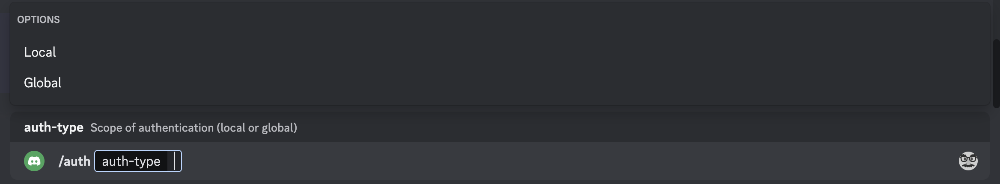
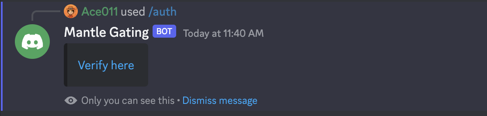
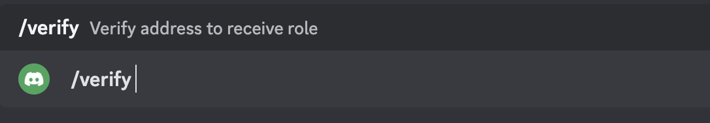

# Discord API and Gating Bot

## Discord Bot

Our bot allows for projects or groups to token gate their discord channels by assigning roles through our discord bot. Using our bot you can easily set up token gating for your discord. It's easy -

1. Invite the bot to your server
2. Run command `/gate` and fill out the info
   1. Type of Token (ERC20 or ERC721)
   2. Contract Address
   3. Balance required (in wei)
   4. Role to be given

 3. If everything worked, you'd receive the message


On user end, they need to Authenticate with our bot, which takes 2 steps:

1. Run command `/auth` and choose whether you want local or global auth
   
2. Go to the given link and sign the message with the wallet you want to auth with
   

### Local Auth vs Global Auth

Our bot allows users to choose between Local Auth or Global Auth, meaning they can either choose to connect their discord Id with a wallet address just in the scope of a server or across all servers. This means if you primarily just use 1 wallet to hold your assets, you won't need to authenticate multiple times for each server but if you still want another address to be linked specifically to a server, you can still do it. Local Auth takes precendence over global auth during verification.

### Authentication

User is redirected to our frontend to authenticate their discord id with our backend.

In the Auth tab, user is required to first connect their wallet and then sign the token generated by our discord bot with their wallet to connect the two in our backend.


### Verification

In the discord servers, users can run `/verify` command to receive the defined roles based on their token holdings for the attached wallet.



## API

Further we provide developers with endpoints to access this data and build their own applications and bots on top of it.


GET

```
<base url>/discord/:userId?:serverId
```


---

This project is not hosted live yet due to basic security concerns, but you can host it or run it on local host.

```
npm install
```

in frontend, backend and the bot directory

to start the frontend run:

```
npm start
```

to start the backend run:

```
node server.js
```

to start the bot run:

```
node index.js
```

to register slash commands for the bot, run:

```
node deploy-commands.js
```

You'd also need to create .env files for these:

1. Backend
   ```
   DATABASE_URL = <mongo DB url>
   SECRET = <passphrase for jwt>
   ```
2. Bot
   ```
   CLIENT_ID = <bot client id>
   TOKEN = <discord bot token>
   RPC = <rpc url>
   SECRET = <passphrase for jwt>
   ```

---

But this is probably too much effort, so contact me on discord for demo or check out the video: Ace011#5743
